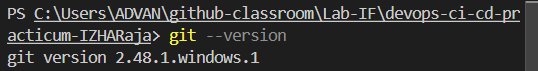
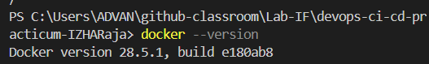
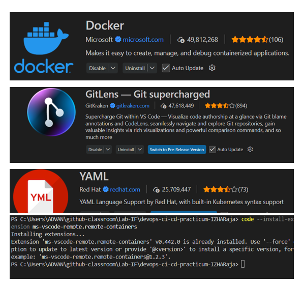

# 105841109023_Izhar - Laporan Pertemuan 01

**Mata Kuliah:** DevOps CI/CD Practicum

**Pertemuan:** 01 — Pengantar DevOps

**Nama:** Izhar

**NIM:** 105841109023

---

## 1. Pemahaman DevOps (contoh teks — minimal 200 kata)

DevOps adalah pendekatan yang menyatukan praktik pengembangan (Development) dan operasi (Operations) untuk mempercepat siklus rilis perangkat lunak dan meningkatkan kualitas layanan. Pendekatan ini menekankan kolaborasi lintas-fungsi, otomatisasi proses berulang (seperti build, test, dan deployment), serta pengukuran performa sehingga tim dapat bereksperimen, belajar, dan memperbaiki sistem secara kontinu. Di lingkungan tradisional, tim pengembang dan tim operasi bekerja terpisah sehingga perubahan sering tertunda dan terjadi banyak kesalahan ketika aplikasi dipindahkan ke lingkungan produksi. DevOps mengurangi silo ini dengan menggunakan versi kontrol untuk semua konfigurasi, menerapkan pipeline CI/CD untuk mengotomatisasi build dan pengujian, serta memperkenalkan praktik Infrastructure as Code untuk mengelola infrastruktur layaknya kode.

Manfaat DevOps mencakup peningkatan frekuensi deployment, deteksi bug lebih awal melalui automated testing, waktu recovery yang lebih cepat saat terjadi insiden, serta budaya kolaboratif yang membuat tanggung jawab menjadi bersama. Contoh perusahaan yang menerapkan DevOps sukses adalah Netflix dan Amazon, yang mengandalkan pipeline otomatis, observability, dan praktik release kecil (small batch) untuk meluncurkan fitur baru dengan cepat dan andal.

Dalam praktikum ini, fokus utama adalah menyiapkan development environment yang konsisten (Git, Docker, VS Code + extensions) sehingga setiap mahasiswa memiliki fondasi yang sama untuk eksperimen lanjutan.

---

## 2. Bukti Instalasi (perintah dan output)

- `git --version`

  Output (contoh):

  `git version 2.48.1.windows.1`

- `git config --list` (hanya tunjukkan `user.name` dan `user.email` pada laporan):

  `user.name=Izhar`

  `user.email=105841109023@student.unismuh.ac.id`

- `docker --version`

  Output (contoh): `Docker version 28.5.1, build e180ab8`

- `docker run hello-world` — hasil: menampilkan `Hello from Docker!` dan menandakan Docker berjalan dengan benar.

Catat: saat mengumpulkan, sertakan screenshot untuk setiap output di folder `screenshots/`.

---

## 3. Bukti Screenshot (format & penamaan)

Silakan masukkan semua screenshot ke folder `screenshots/` dengan nama file persis seperti di bawah. Gunakan gambar berformat PNG atau JPG, resolusi cukup agar teks terminal terbaca (sekitar 1280×720 atau lebih).

- `01-git-version.png` — output `git --version`
- `02-git-config.png` — output `git config --list` (tampilkan `user.name` dan `user.email`)
- `03-docker-version.png` — output `docker --version`
- `04-docker-hello-world.png` — output `docker run hello-world`
- `05-vscode-extensions.png` — tampilan panel Extensions di VS Code yang menunjukkan Docker, GitLens, YAML, Remote - Containers

Contoh cara menyisipkan gambar ke dalam laporan (`README.md`) menggunakan path relatif:

```markdown







```

Gambar yang disisipkan akan muncul langsung saat `README.md` dilihat di GitHub.

---

### Cara cepat membuat screenshot di Windows

1. Buka terminal (PowerShell) dan jalankan perintah yang ingin Anda tangkap, mis. `git --version`.
2. Tekan `Win+Shift+S` lalu pilih area layar yang ingin diambil (Snip & Sketch). Atau gunakan aplikasi `Snipping Tool`.
3. Buka Paint atau editor gambar lain, paste (Ctrl+V) lalu simpan sebagai `screenshots/01-git-version.png`.

### Cara menambahkan file ke repository dan update README

Setelah menaruh semua file screenshot di folder `screenshots/`, jalankan perintah berikut di root repository:

```bash
git add screenshots/01-git-version.png screenshots/02-git-config.png screenshots/03-docker-version.png \
  screenshots/04-docker-hello-world.png screenshots/05-vscode-extensions.png
git add README.md
git commit -m "Add screenshots and update report for Pertemuan 01"
git push origin main
```

Catatan: jika Anda menggunakan branch berbeda, ganti `main` dengan nama branch Anda.

---

## Lampiran — Preview Screenshot

Berikut preview screenshot yang dimasukkan ke laporan. Jika Anda ingin mengganti placeholder dengan gambar asli, timpa file di folder `screenshots/` lalu commit.


## 4. Refleksi singkat

Tuliskan refleksi pribadi di file `refleksi.md` (minimal 100 kata). Contoh topik: harapan dari praktikum, skill yang ingin dikuasai, kendala saat instalasi dan bagaimana Anda mengatasinya.

---

## 5. Struktur Berkas untuk Disubmit

```
105841109023_Izhar_Pertemuan01/
├── README.md
├── refleksi.md
└── screenshots/
    ├── 01-git-version.png
    ├── 02-git-config.png
    ├── 03-docker-version.png
    ├── 04-docker-hello-world.png
    └── 05-vscode-extensions.png
```

Silakan edit bagian `Pemahaman DevOps` atau ganti dengan tulisan Anda sendiri bila perlu. Setelah siap, commit dan push ke repository Anda.
