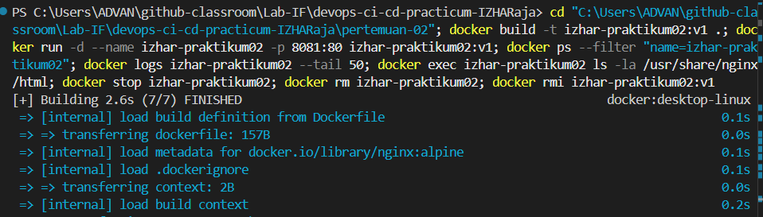
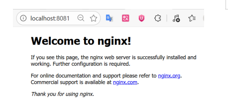
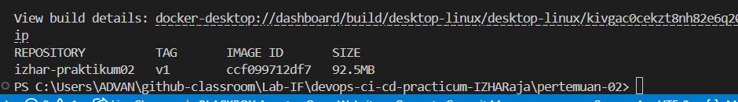
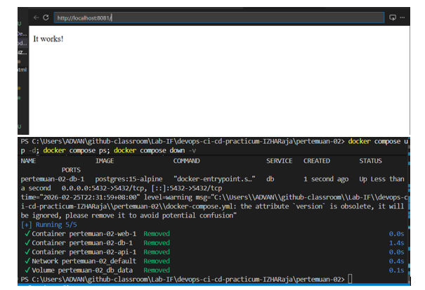

```markdown
# 🐳 Laporan Praktikum Pertemuan 02
## Docker Fundamentals
# 🐳 Laporan Praktikum Pertemuan 02

## Identitas

| Item | Keterangan |
|------|------------|
| Nama | Izhar |
| NIM  | 105841109023 |
| Tanggal | 25 Februari 2026 |

---

## Ringkasan Hasil

- Task 1 (Eksplorasi Docker): container `web-praktikum` dijalankan, logs dan file system nginx diinspeksi.
- Task 2 (Build image): image custom `izhar-praktikum02:v1` berhasil dibuat dan tersedia di host.
- Task 3 (Docker Compose): services `web` (port 8080), `api` (port 8081) dan `db` (port 5432) dijalankan; beberapa penyesuaian port dilakukan agar tidak terjadi konflik.

---

## Bukti & Output Ringkas

### Potongan logs (nginx)

```
/docker-entrypoint.sh: Configuration complete; ready for start up
2026/02/25 14:16:14 [notice] 1#1: using the "epoll" event method
2026/02/25 14:16:14 [notice] 1#1: nginx/1.29.5
```

### Image lokal (setelah build)

```
REPOSITORY          TAG       IMAGE ID       SIZE
izhar-praktikum02   v1        ccf099712df7   92.5MB
```

### Ringkasan `docker compose ps` saat dijalankan

| Service | Image | Ports |
|---------|-------|-------|
| web     | nginx:alpine | 0.0.0.0:8080->80/tcp |
| api     | httpd:alpine | 0.0.0.0:8081->80/tcp |
| db      | postgres:15-alpine | 0.0.0.0:5432->5432/tcp |

---

## Lampiran — Perintah yang Digunakan

Perintah berikut dijalankan untuk verifikasi; disimpan di lampiran sebagai bukti (tidak dimaksudkan sebagai tutorial langkah demi langkah):

```bash
# Task 1
docker pull nginx:alpine
docker run -d --name web-praktikum -p 8080:80 nginx:alpine
docker logs web-praktikum
docker exec web-praktikum ls -la /usr/share/nginx/html
docker exec web-praktikum cat /etc/nginx/nginx.conf
docker stop web-praktikum && docker rm web-praktikum

# Task 2
docker build -t izhar-praktikum02:v1 .
docker images | grep izhar-praktikum02 || true

# Task 3 (compose)
docker compose up -d
docker compose ps
docker compose down -v
```

---

## Lampiran Screenshots

Semua file disimpan di `pertemuan-02/screenshots/`.

| No | File | Preview | Keterangan singkat |
|----|------|---------|--------------------|
| 1 | `porses-build-image.png` |  | Bukti proses build image (`docker build`). |
| 2 | `tampilan-nginx-default.png` |  | Tampilan Nginx di browser (localhost). |
| 3 | `image-custom.png` |  | Daftar image lokal menampilkan `izhar-praktikum02:v1`. |
| 4 | `tampilan-service-docker-compose.png` |  | Hasil `docker compose ps` menunjukkan service yang berjalan. |

---

## Checklist

- [x] Task 1 — Eksplorasi Docker
- [x] Task 2 — Build image custom
- [x] Task 3 — Docker Compose (jalankan & verifikasi)

*Laporan ini disusun singkat tanpa teks tutorial.*